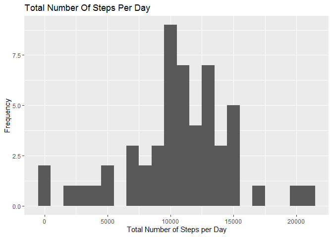
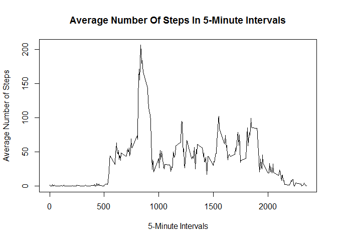
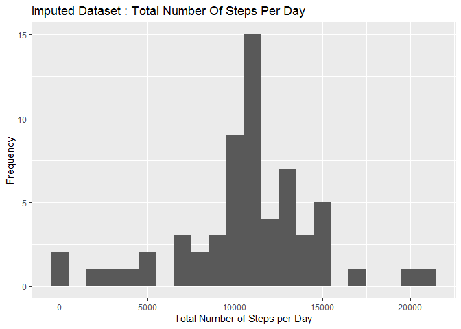
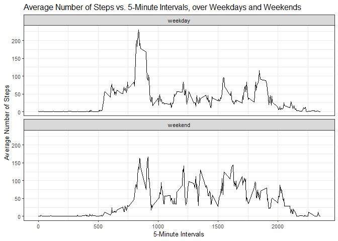

## Loading and preprocessing the data

Load the "dplyr" and the "ggplot2" packages.  
Make sure the "activity.csv" file is placed in the working directory.


```r
# Load the "dplyr" and the "ggplot2" packages.
library(dplyr)
library(ggplot2)

# Make sure the "activity.csv" file is placed in the working directory.
dfAct <- read.csv("./activity.csv")
```

NAs in a numeric vector will sum up to 0 with na.rm = TRUE; it will be better to exclude the NAs before analysis.


```r
dfActNoNA <- dfAct[complete.cases(dfAct), ]
```


## What is mean total number of steps taken per day?


```r
actByDate <- group_by(dfActNoNA, date)
stepSumByDate <- summarize(actByDate, step_sum = sum(steps, na.rm = T))
```


```r
print(qplot(step_sum, data = stepSumByDate, binwidth = 1000,
            main = "Total Number Of Steps Per Day",
            xlab = "Total Number of Steps per Day",
            ylab = "Frequency"))
```

<!-- -->


```r
stepMeanPerDay <- mean(stepSumByDate$step_sum, na.rm = T)
stepMedianPerDay <- median(stepSumByDate$step_sum, na.rm = T)

print(stepMeanPerDay)
```

```
## [1] 10766.19
```

```r
print(stepMedianPerDay)
```

```
## [1] 10765
```

The mean and median of the total number of steps taken per day are :  
Mean : 10766.19  
Median : 10765


## What is the average daily activity pattern?


```r
actByIntvl <- group_by(dfActNoNA, interval)
stepMeanByIntvl <- summarize(actByIntvl, step_mean = mean(steps, na.rm = T))

plot(stepMeanByIntvl$interval, stepMeanByIntvl$step_mean, 
     main = "Average Number Of Steps In 5-Minute Intervals", 
     type = "l", 
     xlab = "5-Minute Intervals", 
     ylab = "Average Number of Steps")
```

<!-- -->


```r
intvlMaxStep <- stepMeanByIntvl$interval[stepMeanByIntvl$step_mean == max(stepMeanByIntvl$step_mean, na.rm = T)]

print(intvlMaxStep)
```

```
## [1] 835
```

5-minute interval (on average across all the days in the dataset) that contains the maximum number of steps : 835


## Imputing missing values


```r
print(sum(is.na(dfAct$steps)))
```

```
## [1] 2304
```

Total number of missing values in the dataset : 2304

Imputing the missing values (NAs) : Replace the NAs with the average number of steps for that 5-minute interval.


```r
# Use the "merge" function to match the NAs to their corresponding values of the 5-minute intervals.
dfActImptd <- merge(dfAct, stepMeanByIntvl, by = "interval", all = T)

# Replace the NAs with the average number of steps for that 5-minute interval.
rowIdxNA <- which(is.na(dfActImptd$steps))
dfActImptd$steps[rowIdxNA] <- dfActImptd$step_mean[rowIdxNA]
dfActImptd <- dfActImptd[c("steps", "date", "interval")]
```


```r
actImptdByDate <- group_by(dfActImptd, date)
stepImptdSumByDate <- summarize(actImptdByDate, step_sum = sum(steps, na.rm = T))

print(qplot(step_sum, data = stepImptdSumByDate, binwidth = 1000,
            main = "Imputed Dataset : Total Number Of Steps Per Day",
            xlab = "Total Number of Steps per Day",
            ylab = "Frequency"))
```

<!-- -->

```r
stepImptdMeanPerDay <- mean(stepImptdSumByDate$step_sum, na.rm = T)
stepImptdMedianPerDay <- median(stepImptdSumByDate$step_sum, na.rm = T)

print(stepImptdMeanPerDay)
```

```
## [1] 10766.19
```

```r
print(stepImptdMedianPerDay)
```

```
## [1] 10766.19
```

Using the imputed dataset, the mean and median of the total number of steps taken per day are :  
Mean : 10766.19  
Median : 10766.19  

Using this imputing strategy, the mean and median values have almost no difference from those obtained in the first part of assignment; the impact of imputing NAs using the current strategy is very small : the median can now have non-integer values; theoretically filling NAs with mean values will also bring median closer to the mean.


## Are there differences in activity patterns between weekdays and weekends?

Adding a column of 2-level factor (weekday and weekend) to the imputed dataframe :


```r
colWeekdays <- weekdays(as.Date(dfActImptd$date), abbreviate = T)
weekends <- colWeekdays == "Sat" | colWeekdays == "Sun"
colWeekdays[weekends] <- "weekend"
colWeekdays[!weekends] <- "weekday"
colWeekdays <- as.factor(colWeekdays)

dfActImptd$day_type <- colWeekdays
```


```r
grpData <- group_by(dfActImptd, interval, day_type)
grpStepMean <- summarize(grpData, group_step_mean = mean(steps, na.rm = T))

gplt <- ggplot(grpStepMean, aes(interval, group_step_mean)) + 
        geom_line() + 
        facet_wrap(.~day_type, nrow = 2, ncol = 1) + 
        theme_bw(base_family = "Avenir", base_size = 10) +
        labs(title = "Average Number of Steps vs. 5-Minute Intervals, over Weekdays and Weekends") + 
        labs(x = "5-Minute Intervals") + 
        labs(y = "Average Number of Steps")

print(gplt)
```

<!-- -->

During weekends, the averaged number of steps is in general larger than that of the weekdays; the averaged number of steps over weekends is also more evenly distributed along the days.


